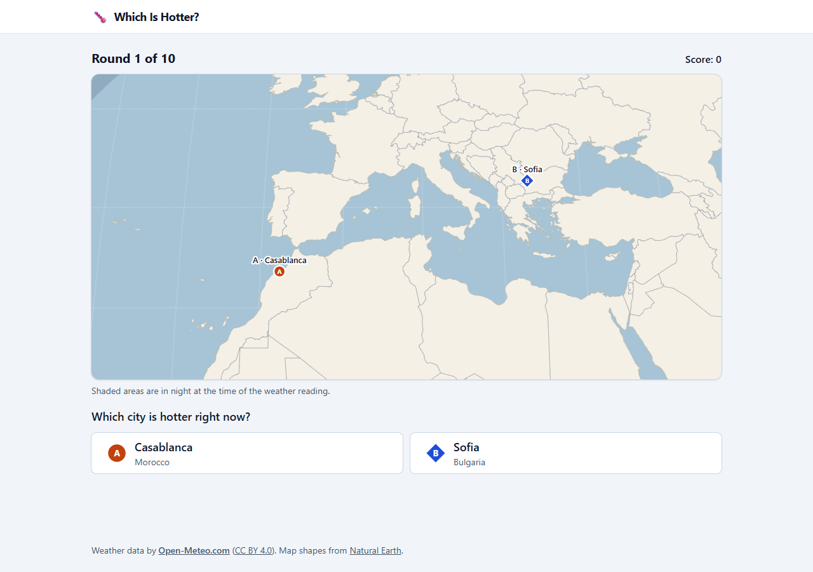
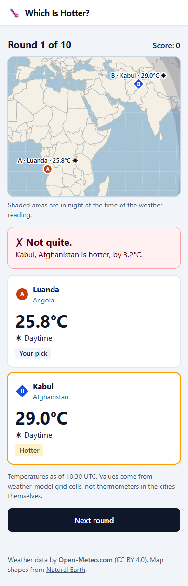
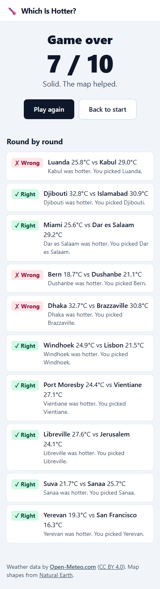
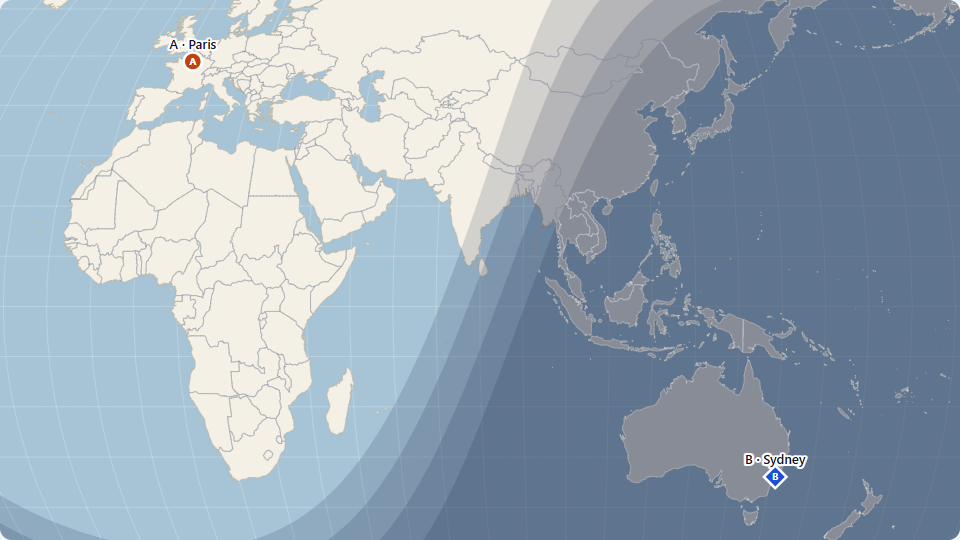
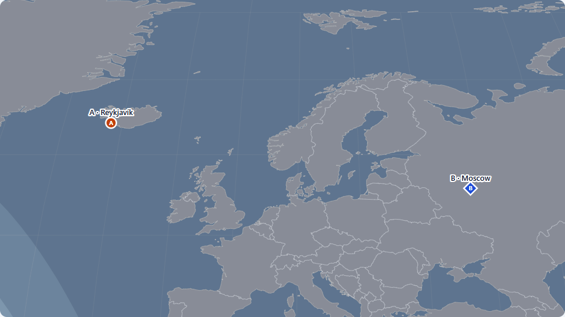
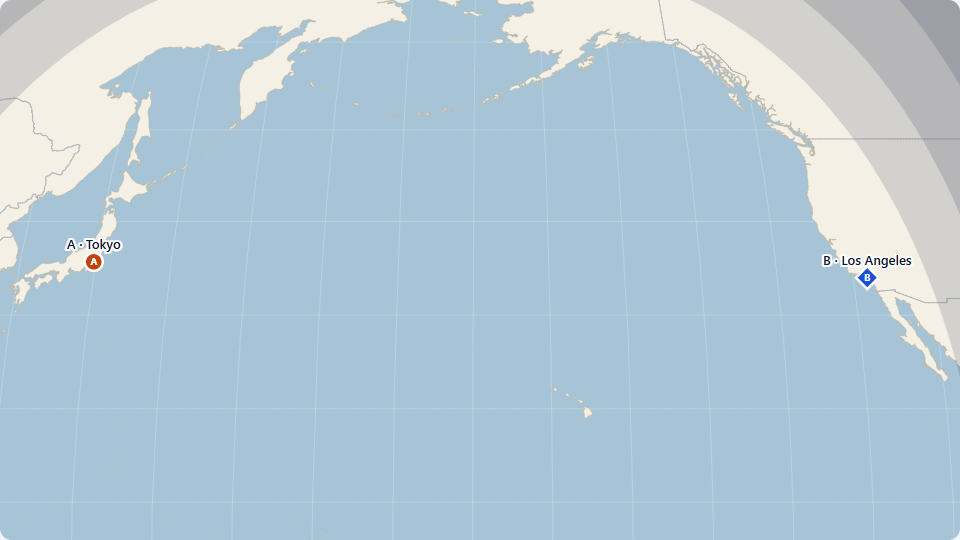

# Which Is Hotter?

A geography-and-weather guessing game. Each round shows two cities on a world map and you pick the one that is hotter **right now**. The map shades the night side of the planet from the real position of the sun, then the reveal shows both live temperatures and whether each city is in day or night. Ten rounds, then a score.

**Live demo:** https://which-is-hotter.vercel.app/



| Reveal on a phone | Results on a phone |
| --- | --- |
|  |  |

## The problem

Guessing "which of these two cities is warmer" is surprisingly hard, and surprisingly interesting: the answer depends on latitude, season, altitude, the time of day at each location, and the weather that happens to be passing through. I wanted a small game where the map itself carries a clue (where is it night?) without giving the answer away.

The project was also a deliberate exercise: build a frontend-only app with real constraints (a rate-limited third-party API, tricky map geometry, pairing logic that needs to be fair) and ship it with tests, accessibility checks, and honest documentation.

## Stack

| Concern | Choice |
| --- | --- |
| UI | React 19 + TypeScript, scaffolded with Vite (`react-ts`) |
| Styling | Tailwind CSS v4 (palette tokens in `src/index.css`) |
| Map maths | `d3-geo` for projection, fit-to-pair zoom and the night terminator. React renders the SVG; d3 only supplies numbers |
| Map data | `world-atlas` (Natural Earth, 50m) + `topojson-client`, **bundled locally** |
| Data fetching | TanStack Query (loading / error / retry) against [Open-Meteo](https://open-meteo.com/) |
| Tests | Vitest (unit), Playwright (browser + visual QA), axe-core (accessibility) |
| Hosting | Vercel (static site; no backend, no router, no secrets) |

There is no backend and no React Router. Home, game and results are three views driven by one `useState` in `App.tsx`; progress through a game is a small reducer.

## How pairing works

Pairing is the part most likely to hide bugs, so it is pure TypeScript with an injectable random number generator and has the most tests (`src/game/pairing.ts`).

1. At game start, a random pool of 70 cities is chosen from a curated list of 183 and their current temperatures are fetched in **one** request. No API calls happen during play.
2. A pair is **valid** if it passes every rule in `src/game/config.ts`:
   - temperature gap between **1 °C and 6 °C**: close enough to be a real question, never a coin flip;
   - at least **2,500 km** apart, so the map is worth looking at;
   - absolute latitudes within **35°** of each other, a cheap stand-in for "same broad climate zone" that rules out obvious polar-vs-tropical rounds;
   - no city appears twice in a game.
3. Valid pairs are ordered by a random score with a small bonus for crossing continents. Then the game is built **nearest band first**: up to 3 regional pairs (< 5,000 km), 4 mid-range, and the rest far apart (> 10,000 km). This was added after a live tuning run showed that rewarding distance made every round a world-scale map; see `DEVLOG.md`.
4. If the strict rules cannot fill 10 rounds: relax the thresholds once on the same data, then fetch one fresh random pool, then fall back to a shorter game (never fewer than 3 rounds). A failure on the second request keeps the first batch rather than throwing a good game away.

In live tuning runs against real weather, the strict rules filled a full 10-round game every time (6 of 6 with the final settings). Run `npm run tune` to measure that yourself after changing a threshold.

## How the day/night shading works

The shading is computed from physics, not painted on.

1. `src/geo/sun.ts` computes the **subsolar point** (where the sun is directly overhead) from a timestamp, using the Astronomical Almanac's low-precision formulas.
2. The night side is everything more than 90° from the subsolar point, i.e. a circle of radius 90° around the opposite point. d3's `geoCircle` produces it as a proper spherical polygon, so poles and the antimeridian are handled by d3, not by hand.
3. Soft twilight bands come from **four stacked circles at 90°, 96°, 102° and 108°** (sunset, then 6°, 12° and 18° below the horizon), each at low opacity, so the shade deepens gradually into full night.
4. The shading uses the **weather data's timestamp**, not the player's clock, so it always agrees with the temperatures on screen.
5. Layer order, bottom to top: ocean, faint graticule, land, night shading, country borders, markers and labels.



**Borders on the night side.** Borders sit above the shading, but a mid-grey line is nearly invisible on shaded land. So there are two passes: dark borders everywhere, plus a light pass of borders and coastline clipped to the night polygon. Both come from the same geometry.



**Zoom and the dateline.** The projection is rotated so the pair's midpoint is the centre of the map; d3 cuts the map at the antimeridian of the *rotated* globe, so a Tokyo-to-Los-Angeles pair is joined across the Pacific instead of split across both edges. The framing fits two buffer circles around the cities (so two cities on the same latitude cannot produce a zero-height box) and clamps the zoom between "whole world" and 6x.



**Verified, not assumed.** The sun maths is unit-tested at solstices and equinoxes and was checked live against Open-Meteo's own `is_day` flag for all 183 cities: 181 agree, and the other two (La Paz and Santiago) sit within 0.7° of the terminator, where the two sources legitimately define sunrise slightly differently (`scripts/check-sun.mjs`). In development the app also cross-checks every round and warns on a real disagreement.

## Accessibility

- Choosing a city uses real `<button>` elements with visible focus; the whole game is playable by keyboard (covered by a Playwright test).
- Focus moves to "Next round" after a guess and to the round heading after that, so screen-reader and keyboard users are never stranded.
- The map is not the only way to understand a round: it has an `aria-label` naming both cities, and the choices and results are plain text.
- Colour is never the only cue: the two markers differ in colour, **shape** (circle vs diamond), letter (A / B) and text label.
- An automated axe-core audit (WCAG 2 A/AA) runs over the home, game, reveal, results and error views.
- Not done: a manual pass with a screen reader. Automated checks do not replace one.

## Data and attribution

- Weather: [Open-Meteo.com](https://open-meteo.com/), licensed [CC BY 4.0](https://creativecommons.org/licenses/by/4.0/); free for non-commercial use. A visible attribution link is in the footer of every screen.
- Values come from **weather-model grid cells**, not thermometers, and the reveal screen says so and shows the data timestamp (e.g. "as of 10:30 UTC").
- Country shapes: [Natural Earth](https://www.naturalearthdata.com/) (public domain) via `world-atlas`. City list: Natural Earth populated places, filtered and committed (see `scripts/generate-cities.mjs`).
- **Rate limit:** the free tier allows 600 *locations* per minute (and 10,000 per day) per IP address, and a 70-city pool counts as 70. One game is comfortably inside that, but many rapid restarts from one connection will hit HTTP 429. The app shows a specific "weather service is busy" message and does not auto-retry a 429.

## Run it locally

Requires a current Node (developed on Node 24; Vite 8 needs 20.19+ or 22.12+).

```bash
npm install
npm run dev          # http://localhost:5173
```

| Command | What it does |
| --- | --- |
| `npm test` | Unit tests (Vitest): pairing, game loader, reducer, sun maths, API parsing, projection |
| `npm run lint` | Oxlint |
| `npm run build` | Type-check and production build to `dist/` |
| `npx playwright test --project=map --project=game` | Browser tests: map visual QA matrix, full game flow with a mocked API, accessibility audit |
| `npx playwright test --project=live` | Real-API smoke test and README screenshots (set `LIVE_URL` to test a deployed site) |
| `npm run tune` | Pairing thresholds against live weather (slow: paced to respect the rate limit) |
| `npm run generate:cities` | Regenerate `src/data/cities.ts` from the Natural Earth files in `scripts/data/` |

Playwright drives the Edge that ships with Windows (`channel: 'msedge'` in `playwright.config.ts`); change it to `chrome`, or run `npx playwright install chromium`, on another machine.

The visual QA screenshots in `docs/qa/` are generated (and git-ignored). The map lab at `/?lab&a=paris&b=sydney&t=2026-06-21T12:00Z` exists **only in development** (`import.meta.env.DEV`) and is removed from production builds.

## Project layout

```
src/
  api/openMeteo.ts      fetch + defensive parsing of the API response
  data/cities.ts        generated list of 183 cities (do not edit by hand)
  game/                 config (all tunable numbers), pairing, loadGame (fallback ladder), matchReducer
  geo/sun.ts            solar position and day/night test
  map/                  projection fitting, night bands, label placement, the WorldMap component
  views/                HomeView, GameView (owns the request), MatchView, ResultsView
  components/           Button, RevealPanel, StatusMessage, Attribution, ...
scripts/                city-list generator and the live sun-maths check
playwright/             map QA matrix, game flow, accessibility, live smoke test
```

## Deploying to Vercel

Everything except the Open-Meteo request is bundled, there are no secrets and no environment variables, and no rewrite rules are needed (there is no router). Import the repository into Vercel and accept the detected Vite defaults (build `npm run build`, output `dist`). After deploying, run `LIVE_URL=https://which-is-hotter.vercel.app npx playwright test --project=live live.spec.ts` to check the production site loads the map and reaches the weather API.

## v2 ideas

- **Hard mode:** no country borders and no city labels on the map, only the markers and the shading.
- **Difficulty settings:** choose the temperature-gap range and whether pairs can share a continent (the numbers already live in `config.ts`).
- **Daily puzzle and leaderboard:** the same ten pairs for everyone each day, with a shared score board. This needs a backend (or a serverless function plus a database) to fix the pairs and store scores.
- Fahrenheit toggle, a manual screen-reader pass, and a dark theme.
